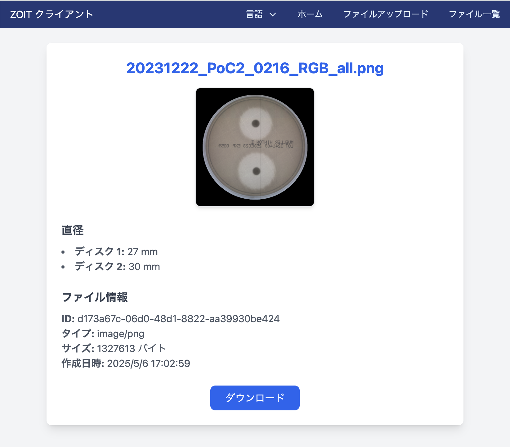

# Zone of Inhibition Tracker (ZOIT)



## Overview

The **Zone of Inhibition Tracker (ZOIT)** is a web-based application designed to streamline the process of managing and analyzing zone of inhibition data. This tool is particularly useful for microbiologists, researchers, and laboratory personnel who need to track and analyze antimicrobial susceptibility test results.

The application provides an intuitive interface for uploading, viewing, and managing files containing zone of inhibition data. It also includes features for visualizing diameters, downloading files, and managing multilingual support.

---

## Features

### 1. **File Management**
- **File Upload**: Upload files containing zone of inhibition data.
- **File List**: View a list of uploaded files with metadata such as file size, type, and creation date.
- **File Details**: View detailed information about a specific file, including diameters and download options.
- **File Deletion**: Delete files with confirmation to prevent accidental removal.

### 2. **Zone of Inhibition Analysis**
- **Diameter Visualization**: Display diameters for each disk in the uploaded files.
- **Error Handling**: Graceful handling of errors during file upload or deletion.

### 3. **Localization**
- **Multilingual Support**: The app supports multiple languages, including English, French and Japanese. Users can switch languages via the navigation bar.

### 4. **User Interface**
- **Responsive Design**: The app is fully responsive and works seamlessly on desktops, tablets, and mobile devices.
- **Navigation Bar**: Access key features like file upload, file list, and language switching from the navigation bar.

### 5. **Notifications**
- **Toast Notifications**: Get real-time feedback for actions like successful uploads, deletions, or errors.

### 6. **Code Coverage**
- The app includes a detailed code coverage report generated using Istanbul, ensuring high-quality and well-tested code.

---

## How to Use

### 1. **Upload a File**
- Navigate to the "File Upload" section.
- Select a file from your local system and click "Upload."
- Receive a confirmation toast notification upon successful upload.

### 2. **View Uploaded Files**
- Navigate to the "File List" section.
- Browse through the list of uploaded files.
- Click on a file to view its details.

### 3. **View File Details**
- In the file details view, you can:
  - See metadata like file ID, size, and creation date.
  - Visualize diameters for each disk.
  - Download the file.

### 4. **Delete a File**
- In the file list, click the delete button next to a file.
- Confirm the deletion in the modal dialog.

### 5. **Switch Language**
- Use the language switcher in the navigation bar to toggle between supported languages.

---

## Tech Stack

- **Frontend**: React, TypeScript, TailwindCSS
- **State Management**: Zustand
- **Routing**: React Router
- **API Integration**: Axios
- **Notifications**: React Toastify
- **Testing**: Vitest, React Testing Library
- **Code Quality**: ESLint, Prettier
- **Build Tool**: Vite

---

## Development

### Prerequisites
- Node.js (v16 or higher)
-  yarn

### Setup
1. Install dependencies:
   ```bash
   npm install
   ```

2. Create a `.env` file based on `.env.sample`:
   ```bash
   cp .env.sample .env
   ```

3. Start the development server:
   ```bash
   yarn dev
   ```

4. Open the app in your browser at `http://localhost:3000`.

---

## Scripts

- **`yarn dev`**: Start the development server.
- **`yarn build`**: Build the app for production.
- **`yarn preview`**: Preview the production build.
- **`yarn lint`**: Run ESLint to check for code quality issues.
- **`yarn format`**: Format the code using Prettier.
- **`yarn test`**: Run unit tests.
- **`yarn test-coverage`**: Generate a code coverage report.

---

## Code Quality

This project follows strict linting and formatting rules defined in the [eslint.config.js](eslint.config.js) file. Key rules include:
- Enforcing single quotes.
- Disallowing `var` in favor of `let` and `const`.
- Enforcing consistent spacing and indentation.